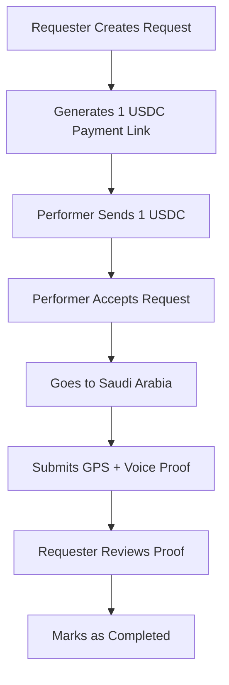

```markdown
# Badal Haji - Decentralized Proxy Hajj Platform

**A simple, paperless, blockchain-powered platform for Badal Haji (Hajj by proxy)** built on Solana.

---

## 🎯 Overview

**Badal Haji** is the Islamic practice where one person performs Hajj on behalf of another who is unable to do so (due to illness, old age, death, etc.).

This web app connects **Requesters** (who need someone to perform Badal Haji) with **Performers** (who will go for Hajj) in a transparent way using **real USDC on Solana Mainnet**.

### Key Features
- Pay **exactly 1 USDC** (≈ $1) as a service/demo fee
- Fully digital proof submission (no paper)
- GPS location verification in Masjid al-Haram
- Voice recording as proof of niyyah (intention)
- Permanent records via Arweave/IPFS
- No custom smart contract needed for MVP

---

## How It Works (No Smart Contract Version)



### Step-by-Step User Flow

1. **Requester** visits the website
   - Fills form: Beneficiary name, reason, special requests
   - App generates a **Solana Payment Link** (Blink/Action) for **1 USDC**

2. **Performer** finds the request
   - Sends **exactly 1 USDC** directly to their own designated wallet
   - Accepts the request in the app

3. **During Hajj** (in Makkah)
   - Performer opens the app near the Kaaba/Haram
   - App captures **GPS coordinates** (must be inside Haram zone)
   - Records **voice proof**: "I am performing Badal Haji for [Name] on behalf of [Requester]..."
   - Uploads recording + GPS data to Arweave (permanent storage)

4. **Proof Submission**
   - All data (GPS, voice hash, timestamp, wallet address) is saved
   - Requester can view the proof anytime

5. **Completion**
   - Requester marks the service as completed
   - Optional rating & review system

---

## Technical Architecture

| Component           | Technology                          | Purpose |
|---------------------|-------------------------------------|--------|
| Frontend            | Next.js 16 + Tailwind + TypeScript | User Interface |
| Wallet Connection   | @solana/wallet-adapter              | Phantom, Solflare, etc. |
| Payments            | Real Mainnet USDC (SPL Token)       | 1 USDC transfer |
| Database            | Supabase (PostgreSQL)               | Store requests & proofs |
| File Storage        | Arweave / IPFS                      | Permanent voice & GPS proofs |
| Hosting             | Vercel                              | Free & fast deployment |

**No Rust / Anchor smart contract required** for this version.

---

## Payment Details

- **Token**: USDC (Mainnet)
- **Mint Address**: `EPjFWdd5AufqSSqeM2qN1xzybapC8G4wEGGkZwyTDt1v`
- **Amount**: **1.000000 USDC** (6 decimals)
- Payment is **direct wallet-to-wallet** (no escrow yet)
- **Receiver address** :`PSKhtWpcVVRyzivKVQcdAqsNeVmJhsmcnbaAJDkP5EE`
---

## Proof System

### 1. GPS Proof
- Uses browser Geolocation API
- Validates user is inside Masjid al-Haram boundaries
- Records timestamp + wallet signature

### 2. Voice Proof
- Records short audio using MediaRecorder
- Generates SHA-256 hash
- Uploads to Arweave for permanent, decentralized storage

---

## Advantages

- Extremely fast & cheap to build and launch
- Uses **real money** (1 USDC) on mainnet
- Paperless and modern
- Transparent proof system
- Can be upgraded later with full escrow smart contract

---

## Limitations (Honest)

- Not fully trustless (relies on reputation for MVP)
- Performer could theoretically take payment and not submit proof
- Requires manual review by requester
- GPS can be spoofed (mitigated with multiple checks)

---

## Future Upgrades (Phase 2)

- Full escrow smart contract (Anchor)
- Reputation system + staking
- AI voice verification
- Multi-signature approval
- NFT completion certificate

---

## How to Run This Project

```bash
git clone <repo-url>
cd badal-haji-app
npm install
npm run dev
```

**Environment Variables Needed**:
- `NEXT_PUBLIC_SUPABASE_URL`
- `NEXT_PUBLIC_SUPABASE_ANON_KEY`
- Arweave wallet key (optional)

---

**Built with ❤️ for the Muslim community**

*This is a demo / MVP project. Always verify performers through proper religious channels for real Badal Haji.*

---

**Last Updated**: May 2026  
**Version**: 1.0 (No-Contract MVP)
```

---

**Copy the entire content above** and save it as `BADAL-HAJI.md` or `README.md`.

Would you like me to also create:
- A more technical version (with code snippets)?
- A presentation-style version?
- Or the actual Next.js project structure?

Just say the word! 🚀